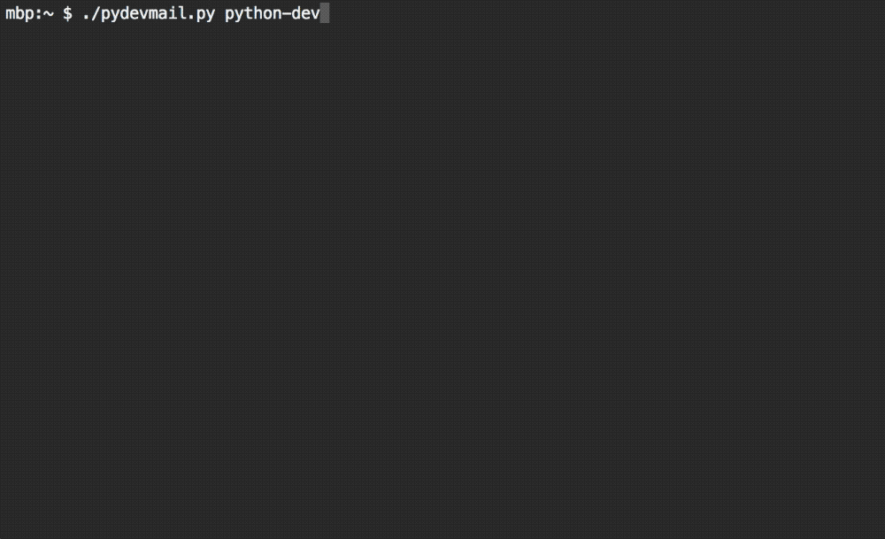

# Purpose

[Python mailing lists](https://mail.python.org/pipermail/?C=M;O=D) is where the development of the language itself happens. Packages like NumPy, SciPy or Pandas also have dedicated mailing lists. You can learn a lot just by reading current discussions or threads from 20+ years ago.

Pydevmail downloads these mailing list archives (like [python-dev](https://mail.python.org/pipermail/python-dev/), [numpy-discussion](https://mail.python.org/pipermail/numpy-discussion/), or [scipy-dev](https://mail.python.org/pipermail/scipy-dev/)) and builds a single text file which can be browsed with a mailbox viewer such as [Mutt](http://www.mutt.org).

# Demo



# Installation

1. Install requests-html:
```
pip3 install requests_html
```
2. Get Pydevmail:
```
wget https://github.com/andportnoy/pydevmail/raw/master/pydevmail.py
```
Make it executable with `chmod +x pydevmail.py`.

If you want to browse the archives from the command line, install Mutt (on a Mac):
```
brew install mutt
```

# Usage

The only command line argument is a name of an official Python mailing list from [this page](https://mail.python.org/pipermail/?C=M;O=D). For instance:
```bash
./pydevmail.py python-dev
```
or
```bash
./pydevmail.py numpy-discussion
```
The first will download the python-dev archives and create a file `python-dev.txt`. Now open it with Mutt:
```bash
mutt -f python-dev.txt
```

To get around in Mutt, use `j` and `k`.

# What

The first thread on python-dev in 1995 is a rant by Linus Torvalds.
